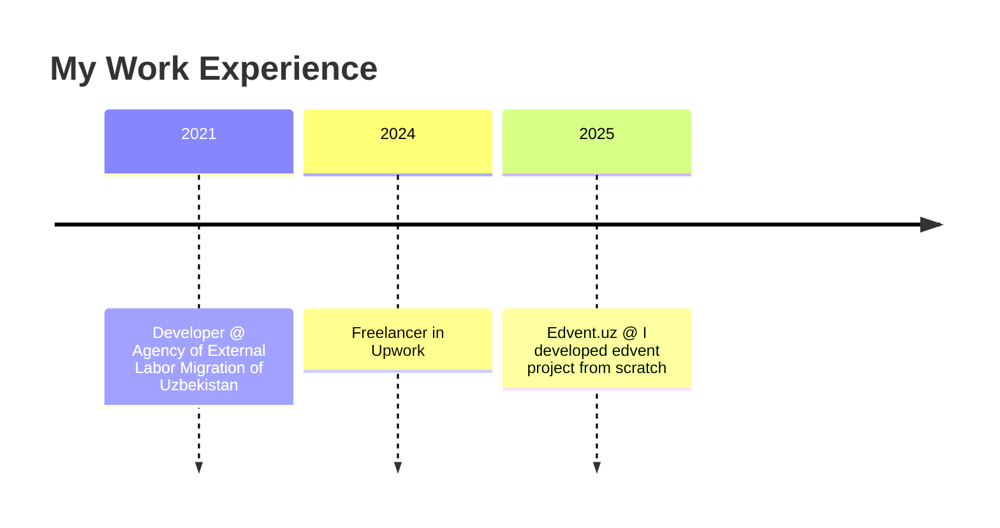

<!-- ==========================================
   🎨 Animated Gradient Header with Wave
========================================== -->
<p align="center">
  
</p>

---

## 📚 TABLE OF CONTENTS
1. [👤 About Me](#-about-me)  
2. [🛠️ Tech Stack & Skills](#️-tech-stack--skills)  
3. [💼 Experience](#-experience)  
4. [🚀 Projects](#-projects)  
5. [🎓 Certifications](#-certifications)  
6. [✍️ Blog & Writing](#️-blog--writing)  
7. [📈 GitHub Stats](#-github-stats)  
8. [📫 Contact Me](#-contact-me)  

---

## 👤 About Me
<p align="center">
  
</p>

> **Backend Developer**  
> Specialized in Django, FastAPI, React, and Docker. Passionate about learning new technologies and exploring innovative ideas.

| 🔭 Current Projects              | 🌱 Currently Learning               | 🤔 Looking For Ideas                |
|----------------------------------|-------------------------------------|-------------------------------------|
| Edvent.uz – Educational Platform | Microservices Architecture in Java  | Open-source collaboration projects |

---

## 🛠️ Tech Stack & Skills

### 🔧 Core Technologies
<p align="center">
  
  
  
  
  
  
</p>

### 🔭 Skill Progress
```text
Python      ■■■■■■■■■■□ 90%
Django      ■■■■■■■■■□□ 85%
FastAPI     ■■■■■■■■□□□ 80%
React       ■■■■■■■□□□□ 75%
Next.js       ■■■■■■■□□□□ 75%
Docker      ■■■■■■■■□□□ 80%
PostgreSQL  ■■■■■□□□□□ 70%
```

---

## 💼 Experience



---

## 🚀 Projects

| Nomi                   | Tavsif                                            | Link                                         |
|------------------------|---------------------------------------------------|----------------------------------------------|
| **Edvent Service**     | REST API for an educational platform (Django)     | [GitHub](https://github.com/dilshod1405/edvent-service) |
| **Edvent Chat**     | Real-time chat with Node.js + socket.io     | [GitHub](https://github.com/dilshod1405/edvent-chat) |
| **Edvent Frontend**     | Creative UI and dashboard for students     | [GitHub](https://github.com/dilshod1405/edvent.uz) |

---

## 🎓 Certifications

<p align="center">
  
</p>

## 📈 GitHub Stats

<p align="center">
  
  &nbsp;
  
  <br/>
  
</p>

---

## 📫 Contact Me

<p align="center">
  <a href="mailto:dilshod@example.com"></a>
  <a href="https://t.me/architect_developer"></a>
  <a href="https://www.instagram.com/shod_developer"></a> 
  <a href="https://linkedin.com/in/dilshod-normurodov-0b886824b"></a>
</p>

---

<p align="center">
  <sub>This README is regularly updated and expanded based on evolving skill sets and technologies. 🚀</sub>
</p>
