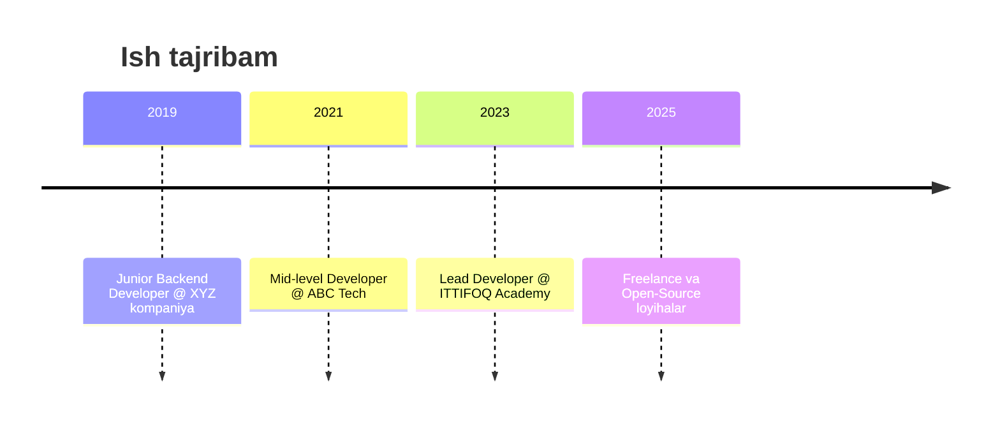

<!-- ==========================================
   🎨 Animated Gradient Header with Wave
========================================== -->
<p align="center">
  
</p>

---

## 📚 MUNDARIJA
1. [👤 About Me](#-about-me)  
2. [🛠️ Tech Stack & Skills](#️-tech-stack--skills)  
3. [💼 Experience](#-experience)  
4. [🚀 Projects](#-projects)  
5. [🎓 Certifications](#-certifications)  
6. [✍️ Blog & Writing](#️-blog--writing)  
7. [📈 GitHub Stats](#-github-stats)  
8. [📫 Contact Me](#-contact-me)  

---

## 👤 About Me
<p align="center">
  
</p>

> **Backend & Fullstack Developer**  
> Django, FastAPI, React, Docker bo‘yicha ixtisoslashgan, har doim yangi texnologiyalarni o‘rganishga intilaman.

| 🔭 Hozirgi loyihalar            | 🌱 O‘rganayotgan mavzular         | 🤔 Qidirayotgan g‘oyalar       |
|----------------------------------|----------------------------------|--------------------------------|
| Edvent – o‘quv platforma backend | Microservices arxitekturasi      | Open-source hamkorlik loyihalari |
| YouTube→MP3 downloader REST API  | Kubernetes & Cloud DevOps        | AI & Chatbot integratsiyalari   |

---

## 🛠️ Tech Stack & Skills

### 🔧 Asosiy Texnologiyalar
<p align="center">
  
  
  
  
  
  
</p>

### 🔭 Skill Progress
```text
Python      ■■■■■■■■■■□ 90%
Django      ■■■■■■■■■□□ 85%
FastAPI     ■■■■■■■■□□□ 80%
React       ■■■■■■■□□□□ 75%
Docker      ■■■■■■■■□□□ 80%
PostgreSQL  ■■■■■□□□□□ 70%
```

---

## 💼 Experience



---

## 🚀 Projects

| Nomi                   | Tavsif                                            | Link                                         |
|------------------------|---------------------------------------------------|----------------------------------------------|
| **Edvent Service**     | O‘quv platforma uchun REST API (Django + DRF)     | [GitHub](https://github.com/dilshod1405/edvent-service) |
| **YT→MP3 Downloader**  | YouTube’dan MP3 yuklab olish REST API (Flask)     | [GitHub](https://github.com/dilshod1405/ytmp3-api)       |
| **Py Codespices**      | Python mini loyihalar to‘plami                    | [GitHub](https://github.com/dilshod1405/py-codespices)  |

---

## 🎓 Certifications

<p align="center">
  
  
</p>

---

## ✍️ Blog & Writing

- [My Technical Blog](https://medium.com/@dilshoddev)  
- So‘nggi maqola: “[FastAPI bilan Tez API Qurish](#)”  

---

## 📈 GitHub Stats

<p align="center">
  
  &nbsp;
  
  <br/>
  
</p>

---

## 📫 Contact Me

<p align="center">
  <a href="mailto:dilshod@example.com"></a>
  <a href="https://t.me/architect_developer"></a>
  <a href="https://linkedin.com/in/dilshod-normurodov-0b886824b"></a>
</p>

---

<p align="center">
  <sub>README har doim yangilanib turadi va texnologiyalar tajribasiga qarab kengaytiriladi. 🚀</sub>
</p>
